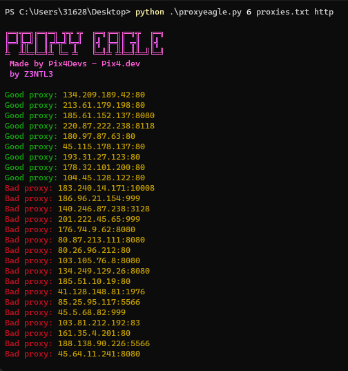

# ProxyEagle
<a href="https://github.com/Z3NTL3/ProxyBeast">Use ProxyBeast instead!</a><br>
**It is a replacement by our-end for ProxyEagle.**<br>
``Proxy Beast is a extremely precisely accurate and fast proxy checker supporting HTTP, HTTPS, SOCK4, SOCKS5.``
<br><br>


 Proxy Eagle is an advanced proxy checker powered with parallelism. Using Sockets. Build with standard python libraries. The only requirement is just Python. 🦅 It can also check proxy anonimity levels. It does that by only checking the ``Via``, ``X-Forwarded-For`` and ``From`` headers.

ProxyEagle is connecting to the proxies and sends a request to Google host if succeeds it saves the good proxies on 'lvl<proxyLevel>.txt' in the same directory as this tool.
<a href="https://www.youtube.com/watch?v=wSUowX1dXgA"> Video Proof</a><br>

<table><tr><th>Organisation</th><th>Application</th><th>Developer</th></tr><tr><td>PIX4</td><td>Proxy Eagle</td><td>Z3NTL3</td></tr></table>

**Usage**<br>
Your ``proxies.txt`` file format needs to be like:
```
proxy:port
``` 
for each line

**Run like:**<br>
```
python3 proxyeagle.py timeout proxies.txt protocol

For socks checking just do python3 proxyeagle.py timeout proxies.txt socks
For http checking just do python3 proxyeagle.py timeout proxies.txt http
For https checking just do python3 proxyeagle.py timeout proxies.txt socks
```
### Features
- Parallel threads
- Custom timeout for proxy check
- Efficient Proxy Check
- HTTP/HTTPS/SOCKS Support

### Requirement
```Python```
```Python 3.2+```
Working on Windows, Linux and Termux emulator.

### Developer
**This application is developed by Z3NTL3 for Pix4.**

By using the application you agree to the following terms of use:
- Stealing code and using it for your own use case is not allowed
- Modifying the application is not allowed
- Selling the application for money is not allowed

**As Pix4 developers, we strive to develop open-source free applications. Please respect our work and so follow the terms of use.**

### Screenshot


